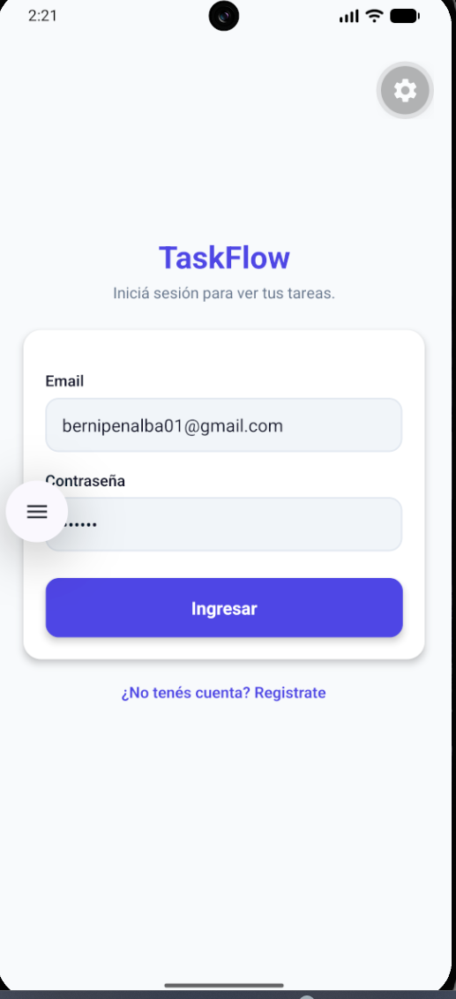
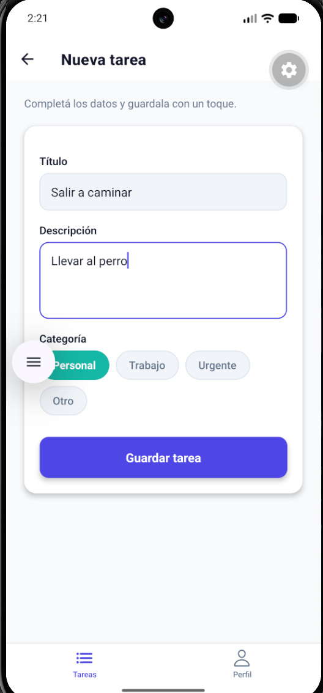
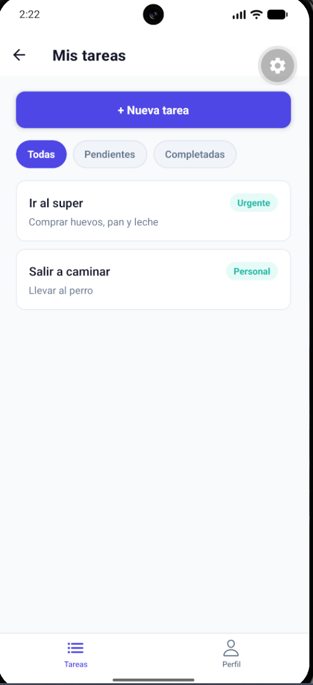
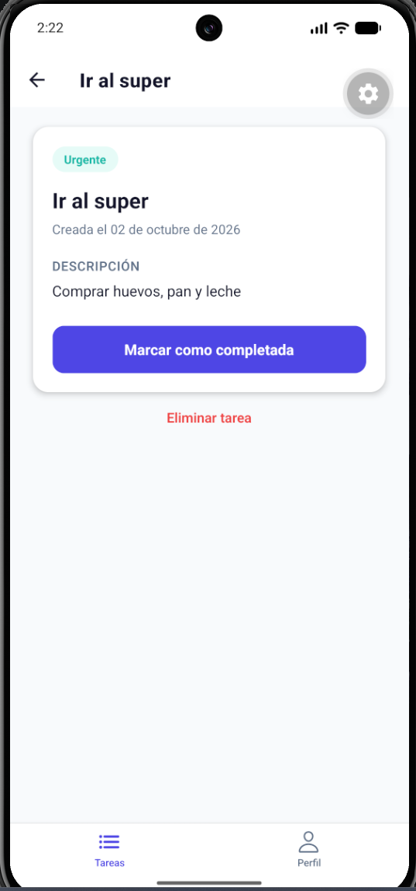
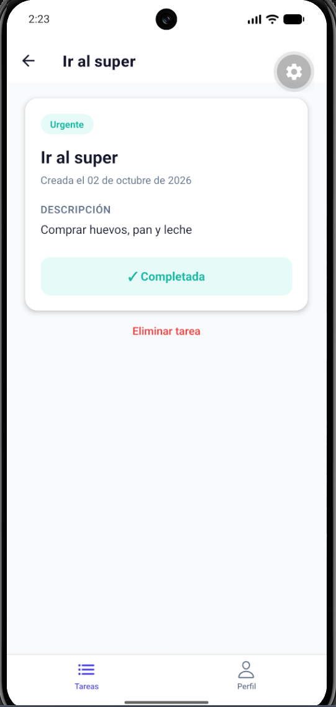
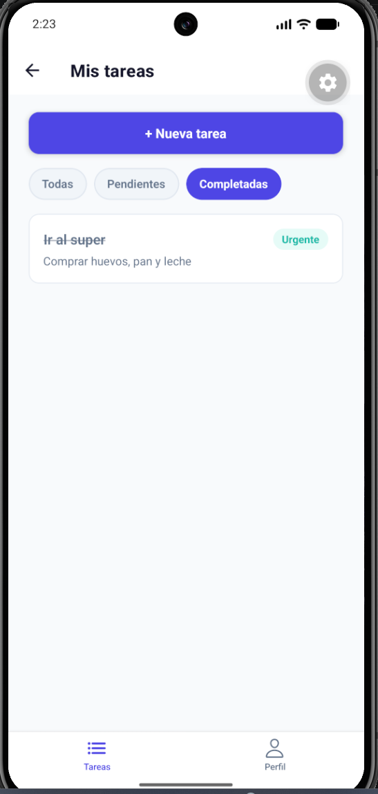
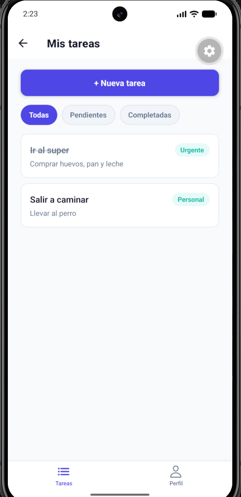
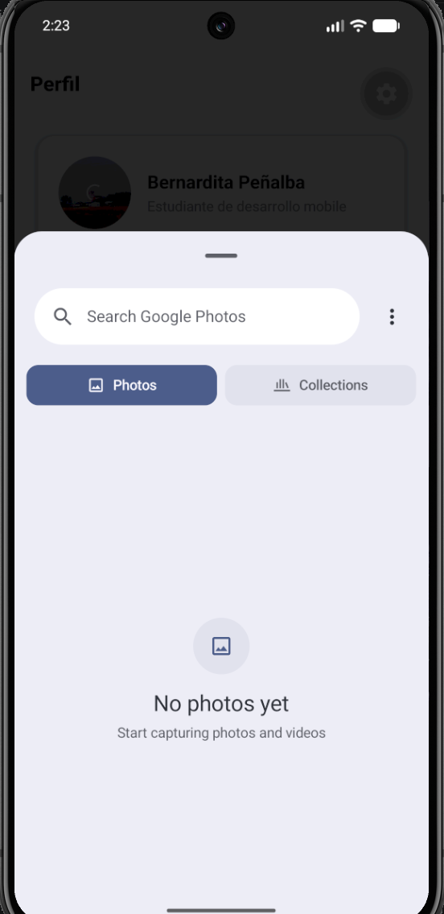
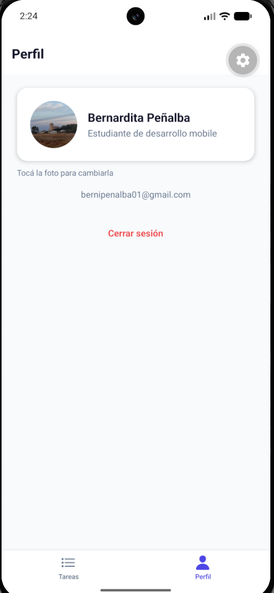

# TaskFlow

Aplicación móvil de gestión de tareas, construida con React Native y Expo
como proyecto final del curso de desarrollo de apps móviles.

## Entrega final: perfil con foto y capturas del flujo completo

Última pieza del recorrido: en "Perfil", el usuario puede tocar su foto
para elegir una de la galería (`expo-image-picker`), que se redimensiona y
comprime con `expo-image-manipulator` y se guarda como texto base64 en
Firestore (`users/{uid}`) — así sobrevive a cerrar la app, sin depender de
Firebase Storage. El detalle de esta arquitectura está documentado más
abajo, en la sección del flujo de autenticación.

**Sobre el link de despliegue:** la consigna sugiere compartir la app vía
Expo Go. Expo cambió su política el 12 de mayo de 2026: Expo Go ahora solo
abre proyectos si quien escanea el QR está logueado con la misma cuenta que
lo publicó, lo que vuelve imposible compartir un link público (confirmado
por el propio soporte de Expo —
[changelog oficial](https://expo.dev/changelog/expo-go-loading-changes-may-2026),
[issue relacionado](https://github.com/expo/eas-cli/issues/3735)). Por eso
la entrega es el repositorio, probado y documentado con las capturas de
abajo en vez de un link público.

### Capturas del flujo completo

| Login | Nueva tarea | Lista de tareas |
|---|---|---|
|  |  |  |

| Detalle de tarea | Tarea completada | Filtro "Completadas" |
|---|---|---|
|  |  |  |

| Lista actualizada | Selector de fotos nativo | Perfil con avatar |
|---|---|---|
|  |  |  |

## Módulo 5: Navegación con React Navigation

TaskFlow pasó de simular pantallas con un estado booleano (`selectedTask`)
a una navegación real con [React Navigation](https://reactnavigation.org/).
La estructura, de afuera hacia adentro, es:

```
NavigationContainer
  Tab.Navigator (barra de pestañas, siempre visible abajo)
    ├─ "Home"    -> Stack.Navigator (TasksStack)
    │                 ├─ TaskList   (lista de tareas)
    │                 ├─ TaskDetail (detalle de una tarea)
    │                 └─ TaskForm   (formulario de nueva tarea)
    └─ "Profile" -> ProfileScreen
```

**Por qué esta estructura (Tabs afuera, Stack adentro):** la barra de
pestañas de abajo queda visible todo el tiempo, incluso navegando en
profundidad dentro de "Tareas" — el mismo patrón que usa Instagram, donde
las pestañas nunca desaparecen ni siquiera viendo el detalle de una
publicación. El `Tab.Screen` de "Home" oculta su propio header
(`headerShown: false`) porque el `Stack.Navigator` interno ya pone uno
propio por pantalla (título dinámico según dónde estés parado).

**Dónde vive el estado:** al tocar una tarea en la lista, se navega pasando
solo su `id` (`navigation.navigate('TaskDetail', { taskId })`); del otro
lado, `TaskDetailScreen` usa ese `id` para pedir el detalle completo (ver
Módulo 6 — desde ahí el array de tareas ya no vive en `AppNavigator.js`,
sino en el store de Redux).

## Módulo 6: Estado global con Redux Toolkit

Las tareas y el filtro activo dejaron de vivir en un `useState` local y
pasaron a un **store de Redux**, con [Redux Toolkit](https://redux-toolkit.js.org/)
(`@reduxjs/toolkit` + `react-redux`). Estructura (organización por
funcionalidad, como ya usábamos en `screens`/`components`):

```
src/
  store/
    store.js              configureStore({ reducer: { tasks: ... } })
  features/
    tasks/
      tasksSlice.js        estado inicial, reducers, acciones y selectores
  components/
    tasks/
      TaskFilterBar.js     componente de presentación (no conoce Redux)
```

**El flujo, de punta a punta:** `App.js` envuelve todo con
`<Provider store={store}>` (por fuera de `SafeAreaProvider` y del
navegador), así que cualquier pantalla puede engancharse al store con los
Hooks de `react-redux`:

- **Leer datos** → `useSelector`. `TaskListScreen` usa `selectVisibleTasks`
  (memoizado con `createSelector`, ya filtrado según `state.tasks.filter`);
  `TaskDetailScreen` usa `selectTaskById(taskId)` para traer una tarea
  puntual.
- **Modificar datos** → `useDispatch`. `TaskFormScreen` despacha `addTask`,
  `TaskDetailScreen` despacha `toggleTaskStatus` y `deleteTask`, y
  `TaskListScreen` despacha `setFilter` cuando se toca un botón de
  `TaskFilterBar`.

Como el estado ya no vive en `AppNavigator.js`, las pantallas del Stack de
tareas volvieron a registrarse con la forma simple
(`<Stack.Screen component={TaskListScreen} />`) en vez del patrón
`children` que hacía falta en el Checkpoint 5 para pasarles `tasks` por
props — ya no hace falta: cada una lee directo del store.

`TaskFilterBar` es un componente de **presentación pura**: recibe
`value`/`onChange` por props y no importa nada de Redux, así que se podría
reusar en cualquier otra pantalla sin cambiarle una línea.

> **Nota:** los reducers `addTask`/`toggleTaskStatus`/`deleteTask` que se
> describen arriba quedaron reemplazados en el Módulo 7 — ver esa sección
> para el flujo actualizado, ahora con Firestore como fuente de verdad.

## Módulo 7: Autenticación y persistencia con Firebase

TaskFlow dejó de ser una app 100% local: ahora cada usuario tiene su propia
cuenta (Firebase Authentication) y sus tareas viven en la nube (Cloud
Firestore), sincronizadas en tiempo real con Redux.

```
src/
  config/
    firebase.js          Singleton: inicializa Firebase con variables de entorno
  services/
    authService.js         login / registro / logout (mensajes de error legibles)
    taskService.js          CRUD de tareas en Firestore, filtrado por usuario
  features/
    auth/
      authSlice.js          user, isCheckingAuth
  navigation/
    AppNavigator.js        raíz: decide Auth vs Main según la sesión
    AuthStack.js            Login / Register
    MainTabs.js              Tabs + Stack de tareas (la app "adentro")
  screens/
    auth/
      LoginScreen.js
      RegisterScreen.js
```

**Navegación protegida:** `AppNavigator.js` es ahora el componente raíz
(mueve para acá el `NavigationContainer` que antes vivía directo en el Tab).
Según `state.auth.user` monta **uno de dos árboles completos**: `AuthStack`
(Login/Register) si no hay sesión, o `MainTabs` (las pestañas de tareas y
perfil) si la hay. No es una pantalla oculta: mientras no haya sesión,
`MainTabs` ni siquiera está registrado, así que no hay forma de navegar "a
mano" hacia las tareas de nadie.

**Persistencia de sesión:** `onAuthStateChanged` (Firebase) se escucha una
sola vez, al montar `AppNavigator`, y actualiza `state.auth.user`. Mientras
todavía no se sabe si hay sesión guardada (`isCheckingAuth`), se muestra un
loader en vez de saltar directo al login — evita el "parpadeo" de mostrar
Login un instante aunque el usuario ya estuviera logueado.

**Las tareas, filtradas por usuario:** un segundo efecto, dependiente de
`user`, se suscribe con `onSnapshot` (tiempo real) a
`query(tasksRef, where('userId', '==', user.uid), orderBy('createdAt', 'desc'))`
y despacha `setTasks` cada vez que cambia algo en el servidor — incluso
desde otro dispositivo. Al cerrar sesión, se despacha `clearTasks` para no
dejar en pantalla las tareas del usuario anterior.

**Quién escribe en Firestore:** `TaskFormScreen` llama a
`addTaskToFirestore(user.uid, {...})` al guardar; `TaskDetailScreen` llama
a `updateTaskInFirestore`/`deleteTaskFromFirestore`. Ninguna pantalla
despacha ya un reducer local para estos casos: Redux se limita a reflejar
lo que el listener de Firestore va reportando (`setTasks`).

### Variables de entorno

Las credenciales de Firebase no están escritas en el código: se leen de
`process.env.EXPO_PUBLIC_...`. Ver `.env.example` para la lista completa;
`.env` (con los valores reales) nunca se sube al repositorio.

### Cómo se probaron los flujos de login y guardado de tareas

1. **Registro:** crear una cuenta nueva con email/contraseña en
   `RegisterScreen` → la app pasa sola a `MainTabs` (sin navegar a mano).
2. **Persistencia de sesión:** cerrar la app por completo y volver a
   abrirla → entra directo a la lista de tareas, sin pedir login de nuevo.
3. **Guardado en Firestore:** crear una tarea desde el formulario → se
   verificó que aparece, en simultáneo, en la consola de Firebase
   (Firestore Database → colección `tasks`) con el `userId` correcto.
4. **Reactividad:** marcar una tarea como completada en el Detalle → el
   cambio se ve al instante en la Lista, sin recargar nada.
5. **Aislamiento por usuario:** cerrar sesión desde Perfil, registrar una
   segunda cuenta de prueba → esa cuenta arranca sin ver ninguna tarea de
   la cuenta anterior.
6. **Errores de login:** probar con una contraseña incorrecta → la pantalla
   de Login muestra el mensaje "La contraseña es incorrecta." en vez de
   romperse o quedar colgada.

## Checkpoint 2: Estructura profesional, ProfileCard y Safe Area

En este checkpoint se organizó el proyecto siguiendo una arquitectura
profesional (`src/screens`, `src/components`, `src/constants`, `src/data`),
se construyó el componente reutilizable `ProfileCard` (recibe sus datos
por props, sin datos hardcodeados), y se agregó soporte de Safe Area con
`react-native-safe-area-context` para respetar notch y barras del
dispositivo.

## Estructura del proyecto

```
App.js                     (envuelve todo con <Provider store={store}>)
index.js
.env.example                (nombres de variables, sin credenciales reales)
src/
  config/
    firebase.js              Singleton de Firebase (auth + db)
  services/
    authService.js
    taskService.js
  navigation/
    AppNavigator.js          raíz: Auth vs Main según la sesión
    AuthStack.js
    MainTabs.js               Tab + Stack de tareas
  store/
    store.js                  (configureStore)
  features/
    tasks/
      tasksSlice.js            (estado, reducers, acciones y selectores de tareas)
    auth/
      authSlice.js              (user, isCheckingAuth)
  components/
    ProfileCard.js
    EmptyState.js
    tasks/
      TaskFilterBar.js
  screens/
    TaskListScreen.js
    TaskDetailScreen.js
    TaskFormScreen.js
    ProfileScreen.js
    auth/
      LoginScreen.js
      RegisterScreen.js
  constants/
    colors.js
  data/
    profileData.js
  assets/
```
## Cómo correrlo localmente

1. Cloná este repositorio.
2. Instalá las dependencias:
   ```
   npm install
   ```
3. Copiá `.env.example` a un archivo nuevo llamado `.env`, y completá cada
   variable con las credenciales de tu propio proyecto de Firebase
   (Firebase Console → Configuración del proyecto → tu Web App).
4. Iniciá el proyecto:
   ```
   npx expo start
   ```
5. Escaneá el código QR con Expo Go, o presioná `a` para abrir en el
   emulador de Android.
